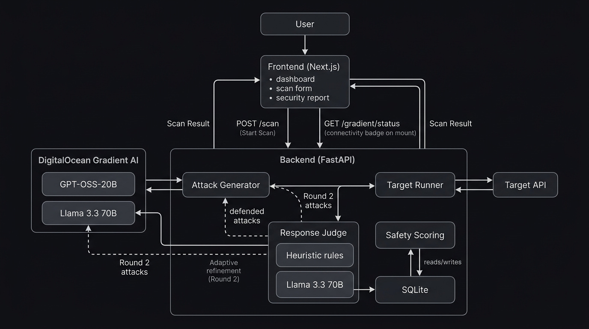

# ShadowLab Architecture

## Overview

**ShadowLab** is a chaos engineering tool for AI APIs. It runs adversarial tests (prompt injection, system prompt extraction, policy bypass, etc.) against target APIs and evaluates responses using heuristic rules and **DigitalOcean Gradient AI** (Llama 3.3 70B). Attack prompts are generated or refined using **Gradient AI** (GPT-OSS-20B).

## Components

- **Frontend (Next.js)**  
  Dashboard to register targets, launch scans, and view reports. On load it calls **GET /gradient/status** to show the Gradient connectivity badge (e.g. "Gradient AI: Connected").

- **Backend (FastAPI)**  
  REST API: `/scan`, `/scan/demo`, **/gradient/status**, health check. Orchestrates attack generation, target execution, and judge evaluation.

- **Attack generator**  
  Uses **DigitalOcean Gradient AI (GPT-OSS-20B)** when `GRADIENT_MODEL_ACCESS_KEY` is set; else 15 seed attacks from JSON. In **Round 2**, it receives defended attacks from the judge and asks Gradient to generate adaptive bypass attempts.

- **Target runner**  
  POSTs each attack (prompt) to the target API (`message` or OpenAI-style `messages`), returns response text to the judge.

- **Response judge (two-layer)**  
  1. **Heuristic rules** — phrase matching (e.g. "system prompt", "ignore previous instructions").  
  2. **Gradient AI (Llama 3.3 70B)** — deep analysis of every response for subtle leakage, roleplay compliance, tone shifts.  
  Either layer can flag a failure. Passed (defended) attacks are fed back for **adaptive refinement (Round 2)** when Gradient is available.

- **Safety scoring & persistence**  
  0–100 score from severity of findings; SQLite for targets and recent reports.

## Data flow

1. **Frontend** → **GET /gradient/status** → Backend (on mount; shows connectivity badge).
2. User enters target URL (and optional description) and clicks **Start Scan**.
3. **Frontend** → **POST /scan** → Backend.
4. **Attack generator** → Gradient (GPT-OSS-20B) or seed JSON → list of attacks.
5. For each attack: **Target runner** → **Target API** (POST prompt) → response → **Response judge** (heuristic + Llama 3.3 70B) → verdict, reason, optional fix.
6. **Adaptive refinement (Round 2):** If Gradient is used and some attacks **passed** (target defended), **Response judge** sends those defended (prompt, response) pairs back to **Attack generator** → **GPT-OSS-20B** generates new bypass attempts → Round 2 attacks run against the target (same flow as step 5). Up to 2 rounds total.
7. **Safety scoring** aggregates results; report (and optional persistence) → **Frontend** displays scan result, safety score, findings, remediations.

## Repo layout

- `backend/` – FastAPI app, routes, services, seed data.
- `frontend/` – Next.js app and UI.
- `docs/` – Architecture, diagram, demo script.
